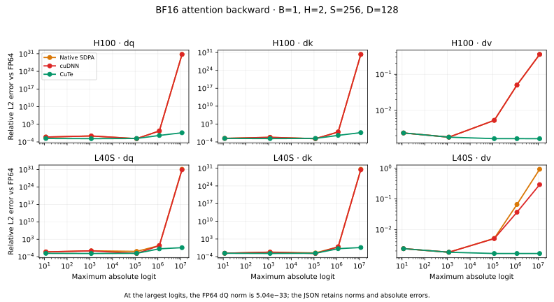

# KohakuFA-CuTe

CuTe attention for Ada and Hopper, with stable backward calculations when attention becomes sharp and logits grow large. Extracted from [SimpleTuner](https://github.com/bghira/SimpleTuner/pull/3256), this implementation brings the precision approach developed by [KohakuFA](https://github.com/KohakuBlueleaf/KohakuFA) to H100 and L40S, with an additional centered backward calculation that retains saturated tiny gradients.

KohakuFA is the originating work: its investigation identified how attention kernels can produce plausible forward outputs and loss while returning incorrect gradients. Read its [precision analysis](https://github.com/KohakuBlueleaf/KohakuFA/blob/efd5b72622ce04fcafbe6ca3e368649d8b7b9527/docs/precision.md) for the original experiments and derivations. The kernels here were developed in SimpleTuner using NVIDIA's CuTe DSL.

## Install

Install a CUDA-enabled PyTorch 2.11 or newer, then:

```bash
git clone https://github.com/SimpleTuner-io/KohakuFA-CuTe.git
cd KohakuFA-CuTe
python -m pip install '.[cuda]'
```

Python 3.12+, CUTLASS DSL 4.8, TVM FFI 0.1.14+, Triton 3.6+, Ninja, and a C++17 compiler are required for CUDA kernels. The native extension builds on first use. `pip install .` installs the public API without the optional CUDA dependencies, allowing native SDPA selection on CPU/MPS.

```python
import torch
from kohakufa_cute import attention, automatic_scaled_dot_product_attention

q = torch.randn(1, 8, 1024, 64, device="cuda", dtype=torch.bfloat16,
                requires_grad=True)
k = torch.randn_like(q, requires_grad=True)
v = torch.randn_like(q, requires_grad=True)

out = attention(q, k, v)                 # strict CuTe, [B, H, S, D]
out.square().mean().backward()
out = attention(q, k, v, causal=True)    # token causal

# PyTorch SDPA arguments; selects native SDPA for unsupported calls.
out = automatic_scaled_dot_product_attention(q, k, v)
compiled = torch.compile(automatic_scaled_dot_product_attention, fullgraph=True)
out = compiled(q, k, v)
```

`attention` and `scaled_dot_product_attention` require supported CUDA inputs and propagate kernel/build errors. `automatic_scaled_dot_product_attention` selects the centered kernels on sm_89/sm_90 and native SDPA otherwise. It never patches PyTorch globally. FP32, dropout, additive masks, unsupported shapes/devices, and missing CUDA dependencies use native SDPA under automatic selection.

Q/K/V use matching FP16 or BF16 dtypes, with equal key/value shapes. Boolean masks use `True` for visible keys and broadcast to `[B, H, Sq, Sk]`; all-hidden rows return zero. `attention` supports implicit GQA and combining `mask` with `causal=True`. The SDPA wrappers require `enable_gqa=True` for differing head counts and causal visibility folded into an explicit boolean mask.

## Why forward correctness is not enough

Attention backward reconstructs probabilities rather than storing the full attention matrix. Small errors in that reconstruction matter most when one key dominates: the query/key gradients subtract nearly equal quantities, even though the forward output still closely resembles the selected value.

The standard positive-scale calculation can be written as:

```text
S = Q @ Kᵀ
c = scale · log₂(e)
m = max(S) per row
log_l = log₂(sum(exp₂((S - m) · c)))
P = exp₂((S - m) · c - log_l)
dP = dO @ Vᵀ
dS = P · (dP - sum(P · dP))
dQ = (dS @ K) · scale
dK = (dSᵀ @ Q) · scale
dV = Pᵀ @ dO
```

Three arithmetic choices can damage this backward calculation:

| Choice | What is lost | CuTe calculation |
| --- | --- | --- |
| Save `c·m + log_l` in one FP32 value | A large maximum can swallow the small normalization term | Save the unscaled maximum and logarithmic normalization separately |
| Scale large scores before subtracting the maximum | Close scores can lose their difference; the maximum can acquire a rounding residual | Subtract the unscaled maximum first, then scale |
| Convert `scale·dS` to a low-precision tensor-core operand | Small derivatives underflow earlier | Convert the unscaled derivative; apply scale after FP32 accumulation |

FP32 intermediates are part of the issue, so changing FP16 inputs to BF16 does not fix it. BF16's wider exponent range helps range, while its shorter mantissa can amplify cancellation. This is relevant wherever a model's attention becomes sharp; diagnosis should compare backward gradients on identical rounded inputs against a stable reference.

### Centered backward and tiny gradients

Ada/Hopper backward uses an output/dO dot product as a centering base, then recomputes the remaining softmax correction in FP32. The base and residual stay separate through the query/key gradient products. The rounded output is not treated as the final correction. This retains the tail contribution when ordinary subtraction would round it away.

The regression suite includes a BF16 saturated lookup whose FP64 query derivative is `1.92874984796e-21`; CuTe returns `1.93229391092e-21`. The reference is also checked against a 100-digit decimal finite difference. This is a more useful check than merely requiring finite gradients: zero is finite too.

## KohakuFA and CuTe

| Piece | KohakuFA | KohakuFA-CuTe |
| --- | --- | --- |
| Kernel language | Triton Gluon | NVIDIA CuTe DSL plus a small C++/TVM FFI launcher |
| GPU implementation | Blackwell tcgen05/TMA | Ada warp MMA; Hopper WGMMA/TMA |
| Large-logit arithmetic | Separate statistics, shift before scale, late gradient scaling | Same approach, with centered FP32 residual correction on Ada/Hopper |
| Masks | Boolean masks can be packed once and reused | Tiles classified on every call, including CUDA graph replay |
| PyTorch integration | Custom operators with autograd | Native eager autograd; custom operators for compiled training |
| Packed variable length / frame-causal API | Dedicated APIs | Boolean masks express frame visibility; no packed-varlen API |
| Supported head dimensions | Up to 512 | 1–512, including tails and GQA |

Explicit CuTe calls also have an experimental sm_120 path. Automatic selection uses native SDPA there because the centered Ada/Hopper backward is the default precision contract.

### Upstream published results

[KohakuFA's README](https://github.com/KohakuBlueleaf/KohakuFA/tree/efd5b72622ce04fcafbe6ca3e368649d8b7b9527#precision) reports the following worst-layer dK relative errors against FP64 on pretrained DINOv3 ViT-B/16, using B300:

| Input dtype | cuDNN SDPA | FlashAttention-4 | KohakuFA | Correct-kernel floor |
| --- | ---: | ---: | ---: | ---: |
| FP16 | 5.4e-2 | 5.5e-2 | 2.2e-3 | 2.1e-3 |
| BF16 | 5.0e-1 | 5.0e-1 | 9.5e-3 | 9.3e-3 |

Its [B300 speed results](https://github.com/KohakuBlueleaf/KohakuFA/tree/efd5b72622ce04fcafbe6ca3e368649d8b7b9527#speed) report dense forward/backward at 2k tokens as 2.7× FlashAttention-2, with token-causal forward/backward 4–12% behind the fastest cuDNN/FA4 path. Upstream numbers are published results; H100/L40S numbers are our measurements, with device, dtype, shape, and measurement type attached to each table.

### H100 and L40S attention measurements

Results and reproduction commands are recorded in [results/README.md](results/README.md). Forward/backward times include forward and exclude first-use compilation.

BF16 dense attention, batch 1, 16 heads. Median CUDA-graph replay time over six rotating-order repetitions, 100 timed replays per sample. `fwd+bwd` includes forward. Full forward timings and per-repetition samples are in the linked JSON.

| GPU | Tokens | Head dim | Native fwd+bwd (ms) | cuDNN fwd+bwd (ms) | CuTe fwd+bwd (ms) | CuTe / native |
| --- | ---: | ---: | ---: | ---: | ---: | ---: |
| H100 | 1024 | 64 | 0.0526 | 0.0527 | 0.0687 | 1.31× |
| H100 | 1024 | 128 | 0.0772 | 0.0771 | 0.0903 | 1.17× |
| H100 | 1024 | 256 | 0.1990 | 0.1992 | 0.3577 | 1.80× |
| H100 | 4096 | 64 | 0.5742 | 0.5630 | 0.8665 | 1.51× |
| H100 | 4096 | 128 | 0.9274 | 0.9634 | 1.3003 | 1.40× |
| H100 | 4096 | 256 | 2.4692 | 2.4793 | 4.7097 | 1.91× |
| L40S | 1024 | 64 | 0.0992 | 0.1156 | 0.1264 | 1.27× |
| L40S | 1024 | 128 | 0.1918 | 0.1971 | 0.2381 | 1.24× |
| L40S | 1024 | 256 | 0.5381 | — | 0.6788 | 1.26× |
| L40S | 4096 | 64 | 1.2418 | 1.2777 | 1.9111 | 1.54× |
| L40S | 4096 | 128 | 2.7209 | 2.8219 | 3.5472 | 1.30× |
| L40S | 4096 | 256 | 7.8879 | — | 10.5166 | 1.33× |

A dash indicates that cuDNN did not provide a kernel for that timing call. Source data: [H100](results/h100-speed.json), [L40S](results/l40s-speed.json).

### Large-logit precision measured here

BF16, `[1, 2, 256, 128]`, seeded synthetic inputs, maximum absolute logit approximately `1.16e7`. Relative L2 error against centered FP64 backward:

| GPU | Kernel | dQ | dK | dV |
| --- | --- | ---: | ---: | ---: |
| H100 | Native SDPA | 5.51e+30 | 1.86e+30 | 0.355 |
| H100 | cuDNN | 5.51e+30 | 1.86e+30 | 0.355 |
| H100 | CuTe | 0.432 | 0.432 | 0.00165 |
| L40S | Native SDPA | 1.29e+31 | 3.89e+30 | 0.934 |
| L40S | cuDNN | 7.66e+30 | 2.35e+30 | 0.294 |
| L40S | CuTe | 0.432 | 0.432 | 0.00165 |

All three forward output errors are zero at this point, while their backward errors differ dramatically. The FP64 dQ norm is `5.04e-33`, so a spurious derivative produces a very large relative error. CuTe retains a nonzero derivative with cosine approximately `0.999999`; its relative error is still `0.432`. The JSON includes reference norms, norm ratios, and absolute errors for the full sweep rather than only this endpoint.



Precision source data: [H100](results/h100-precision.json), [L40S](results/l40s-precision.json).

### SimpleTuner training-block measurements

These are full compiled transformer-block optimizer steps, including LoRA and activation checkpointing, measured before extraction with the same kernel implementation. H100, BF16, 4096 image tokens, LoRA rank 16, learning rate zero; 20 warmup steps, 100 timed steps, and 12 rotating-order repetitions. Native SDPA is the baseline.

| Block | Native SDPA | Automatic CuTe | Step-time change |
| --- | ---: | ---: | ---: |
| Flux | 10.640 ms | 11.477 ms | +7.9% |
| MiniMax-H3 | 24.206 ms | 25.668 ms | +6.0% |

The stronger gradient calculation has a throughput cost on these blocks. SimpleTuner accepts that cost for its automatic training default. These timings hold weights fixed for matched performance measurements; optimizer-update correctness is tested separately.

## Reproduce

```bash
python -m unittest discover -v -f
python -m benchmarks.precision --dtype bf16 --seq 256 --dim 128 \
  --backends auto cudnn kohakufa-cute --output results/precision.json
python -m benchmarks.speed --dtype bf16 --seq 1024 4096 --dim 64 128 256 \
  --output results/speed.json
```

The precision sweep uses FP64 analytical backward with a centered correction, on exactly the same rounded Q/K/V and upstream gradient. It reports output and dQ/dK/dV relative error, norm ratio, cosine, and finiteness. Timings replay CUDA graphs and rotate backend order between repetitions. Add `--backends ... kohakufa` to run an installed upstream KohakuFA on a supported device.

Tests cover masks and all-hidden rows, GQA, arbitrary head tails, signed/zero scales, noncontiguous storage, large logits, saturated tiny gradients, eager/compiled backward, checkpointed LoRA optimizer updates, concurrent streams, cache release, and mutable masks during CUDA graph replay.

## License and attribution

The extracted SimpleTuner implementation is [AGPL-3.0-or-later](LICENSE). NVIDIA CUTLASS and FlashAttention helper adaptations retain their BSD notices in [NOTICE](NOTICE) and [LICENSES/BSD-3-Clause.txt](LICENSES/BSD-3-Clause.txt). KohakuFA receives credit for the precision investigation and approach; its Gluon kernels are not bundled here.
